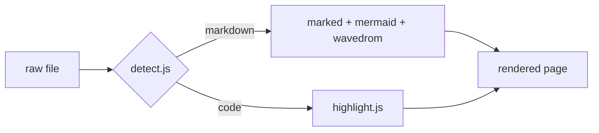
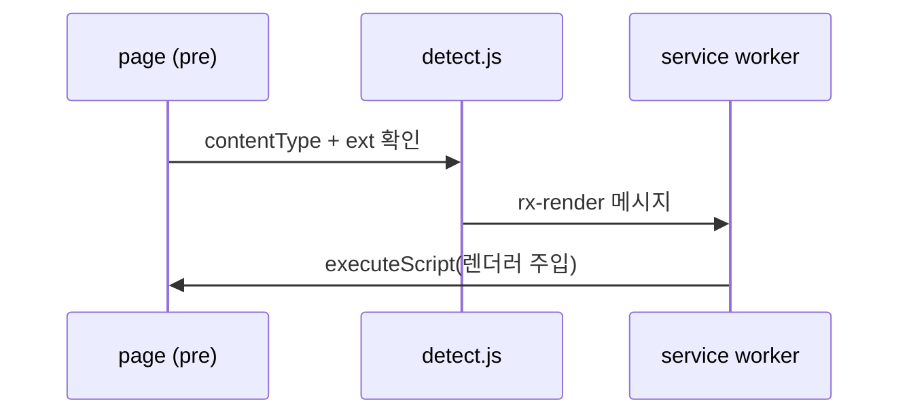

# render-ext 기능 테스트

이 파일 하나로 Markdown 파이프라인 전체를 검증한다: front matter, 콜아웃,
mermaid, wavedrom, 문법강조, 체크포인트(미지원 fence) 처리.

:::tldr
front matter는 접힌 `details`로, `:::` 콜아웃은 색 박스로, mermaid/wavedrom
코드블록은 다이어그램으로 렌더되어야 한다.
:::

## 1. Mermaid — flowchart



## 2. Mermaid — sequence



## 3. WaveDrom — handshake 예제

```wavedrom
{ signal: [
  { name: "clk",   wave: "p......." },
  { name: "req",   wave: "0.1..0.." },
  { name: "ack",   wave: "0..1..0." },
  { name: "data",  wave: "x..=..x.", data: ["D0"] }
]}
```

## 4. 문법강조 — SystemVerilog

```systemverilog
module handshake #(parameter W = 32) (
  input  logic         clk, rst_n,
  input  logic         req,
  output logic         ack,
  input  logic [W-1:0] data
);
  always_ff @(posedge clk or negedge rst_n)
    if (!rst_n) ack <= 1'b0;
    else        ack <= req;
endmodule
```

## 5. 문법강조 — Python

```python
def bd_rate(anchor: list[float], test: list[float]) -> float:
    """Toy placeholder — not a real BD-rate."""
    return sum(t - a for a, t in zip(anchor, test)) / len(anchor)
```

:::gotcha
mermaid 문법 오류가 나도 나머지 다이어그램은 계속 렌더되어야 한다.
아래 블록은 **의도된 오류**다 — 에러 박스 + 원본 코드가 보이면 정상.
:::

```mermaid
flowchart LR
    A --> ( 이건 문법 오류
```

:::analogy
detect.js는 문지기, service worker는 창고지기 — 무거운 라이브러리(3.5MB
mermaid)는 필요한 페이지에만 배달된다.
:::

## 6. 미지원 fence (uvm-drill 체크포인트)

```check
Q: content script는 어느 world에서 실행되는가?
A: isolated world — 페이지 JS와 격리되지만 DOM은 공유.
H: MAIN world 옵션도 있다 (MV3 world 파라미터).
```

## 7. 표 + 링크

| 단계 | 내용 | 상태 |
|---|---|---|
| Phase 0 | 리서치 | ✅ |
| Phase 1 | Markdown 렌더러 | 이 파일로 검증 |
| Phase 2 | Verilog 문법강조 | `axi_arbiter.sv`로 검증 |

[같은 폴더의 Verilog 샘플](./axi_arbiter.sv) — 링크 클릭 시 코드 뷰로 렌더되면
file:// 탐색 연동도 OK.
